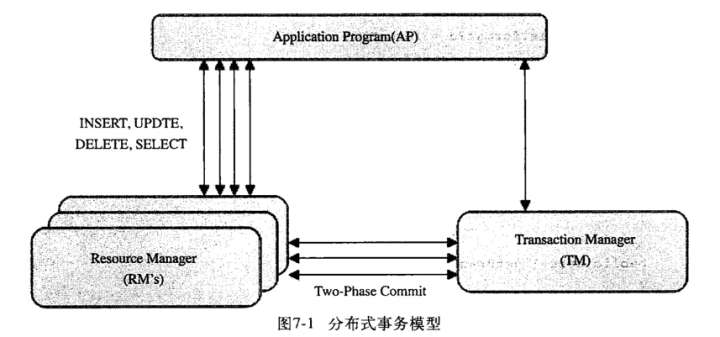

# MySQL 事务

MySQL 事务主要用于处理操作量大，复杂度高的数据。比如说，在人员管理系统中，你删除一个人员，你即需要删除人员的基本资料，也要删除和该人员相关的信息，如信箱，文章等等，这样，这些数据库操作语句就构成一个事务！ 


### ACID — 事务基本要素

事务是由一组SQL语句组成的逻辑处理单元，具有4个属性，通常简称为事务的ACID属性。

- **A (Atomicity) 原子性**：整个事务中的所有操作，要么全部完成，要么全部不完成，不可能停滞在中间某个环节。事务在执行过程中发生错误，会被回滚（Rollback）到事务开始前的状态，就像这个事务从来没有执行过一样。
- **C (Consistency) 一致性**：在事务开始之前和事务结束以后，数据库的完整性约束没有被破坏。
-  **I (Isolation)隔离性**：隔离状态执行事务，使它们好像是系统在给定时间内执行的唯一操作。如果有两个事务，运行在相同的时间内，执行 相同的功能，事务的隔离性将确保每一事务在系统中认为只有该事务在使用系统。这种属性有时称为串行化，为了防止事务操作间的混淆，必须串行化或序列化请 求，使得在同一时间仅有一个请求用于同一数据。
- **D (Durability) 持久性**：在事务完成以后，该事务所对数据库所作的更改便持久的保存在数据库之中，并不会被回滚。


### 事务隔离级别

**并发事务处理带来的问题**

- 更新丢失（Lost Update)： 事务A和事务B选择同一行，然后基于最初选定的值更新该行时，由于两个事务都不知道彼此的存在，就会发生丢失更新问题 
- 脏读(Dirty Reads)：事务A读取了事务B更新的数据，然后B回滚操作，那么A读取到的数据是脏数据
- 不可重复读（Non-Repeatable Reads)：事务 A 多次读取同一数据，事务 B 在事务A多次读取的过程中，对数据作了更新并提交，导致事务A多次读取同一数据时，结果 不一致。
- 幻读（Phantom Reads)：系统管理员A将数据库中所有学生的成绩从具体分数改为ABCDE等级，但是系统管理员B就在这个时候插入了一条具体分数的记录，当系统管理员A改结束后发现还有一条记录没有改过来，就好像发生了幻觉一样，这就叫幻读。


**幻读和不可重复读的区别：**

- 不可重复读的重点是修改：在同一事务中，同样的条件，第一次读的数据和第二次读的数据不一样。（因为中间有其他事务提交了修改）
- 幻读的重点在于新增或者删除：在同一事务中，同样的条件,，第一次和第二次读出来的记录数不一样。（因为中间有其他事务提交了插入/删除）


**并发事务处理带来的问题的解决办法：**

- “更新丢失”通常是应该完全避免的。但防止更新丢失，并不能单靠数据库事务控制器来解决，需要应用程序对要更新的数据加必要的锁来解决，因此，防止更新丢失应该是应用的责任。

- “脏读” 、 “不可重复读”和“幻读” ，其实都是数据库读一致性问题，必须由数据库提供一定的事务隔离机制来解决：

  - 一种是加锁：在读取数据前，对其加锁，阻止其他事务对数据进行修改。
  - 另一种是数据多版本并发控制（MultiVersion Concurrency Control，简称 **MVCC** 或 MCC），也称为多版本数据库：不用加任何锁， 通过一定机制生成一个数据请求时间点的一致性数据快照 （Snapshot)， 并用这个快照来提供一定级别 （语句级或事务级） 的一致性读取。从用户的角度来看，好象是数据库可以提供同一数据的多个版本。


查看当前数据库的事务隔离级别：  

```mysql
show variables like 'tx_isolation'
```


数据库事务的隔离级别有4种，由低到高分别为Read uncommitted 、Read committed 、Repeatable read 、Serializable 。下面通过事例一一阐述在事务的并发操作中可能会出现脏读，不可重复读，幻读和事务隔离级别的联系。

数据库的事务隔离越严格，并发副作用越小，但付出的代价就越大，因为事务隔离实质上就是使事务在一定程度上“串行化”进行，这显然与“并发”是矛盾的。同时，不同的应用对读一致性和事务隔离程度的要求也是不同的，比如许多应用对“不可重复读”和“幻读”并不敏感，可能更关系数据并发访问的能力。

#### Read uncommitted

读未提交，就是一个事务可以读取另一个未提交事务的数据。

事例：老板要给程序员发工资，程序员的工资是3.6万/月。但是发工资时老板不小心按错了数字，按成3.9万/月，该钱已经打到程序员的户口，但是事务还没有提交，就在这时，程序员去查看自己这个月的工资，发现比往常多了3千元，以为涨工资了非常高兴。但是老板及时发现了不对，马上回滚差点就提交了的事务，将数字改成3.6万再提交。

分析：实际程序员这个月的工资还是3.6万，但是程序员看到的是3.9万。他看到的是老板还没提交事务时的数据。这就是脏读。

那怎么解决脏读呢？Read committed！读提交，能解决脏读问题。

#### Read committed

读提交，顾名思义，就是一个事务要等另一个事务提交后才能读取数据。

事例：程序员拿着信用卡去享受生活（卡里当然是只有3.6万），当他埋单时（程序员事务开启），收费系统事先检测到他的卡里有3.6万，就在这个时候！！程序员的妻子要把钱全部转出充当家用，并提交。当收费系统准备扣款时，再检测卡里的金额，发现已经没钱了（第二次检测金额当然要等待妻子转出金额事务提交完）。程序员就会很郁闷，明明卡里是有钱的…

分析：这就是读提交，若有事务对数据进行更新（UPDATE）操作时，读操作事务要等待这个更新操作事务提交后才能读取数据，可以解决脏读问题。但在这个事例中，出现了一个事务范围内两个相同的查询却返回了不同数据，这就是不可重复读。

那怎么解决可能的不可重复读问题？Repeatable read ！

#### Repeatable read

重复读，就是在开始读取数据（事务开启）时，不再允许修改操作。 MySQL的默认事务隔离级别 

事例：程序员拿着信用卡去享受生活（卡里当然是只有3.6万），当他埋单时（事务开启，不允许其他事务的UPDATE修改操作），收费系统事先检测到他的卡里有3.6万。这个时候他的妻子不能转出金额了。接下来收费系统就可以扣款了。

分析：重复读可以解决不可重复读问题。写到这里，应该明白的一点就是，不可重复读对应的是修改，即UPDATE操作。但是可能还会有幻读问题。因为幻读问题对应的是插入INSERT操作，而不是UPDATE操作。

**什么时候会出现幻读？**

事例：程序员某一天去消费，花了2千元，然后他的妻子去查看他今天的消费记录（全表扫描FTS，妻子事务开启），看到确实是花了2千元，就在这个时候，程序员花了1万买了一部电脑，即新增INSERT了一条消费记录，并提交。当妻子打印程序员的消费记录清单时（妻子事务提交），发现花了1.2万元，似乎出现了幻觉，这就是幻读。

那怎么解决幻读问题？Serializable！

#### Serializable 序列化

Serializable 是最高的事务隔离级别，在该级别下，事务串行化顺序执行，可以避免脏读、不可重复读与幻读。简单来说，Serializable会在读取的每一行数据上都加锁，所以可能导致大量的超时和锁争用问题。这种事务隔离级别效率低下，比较耗数据库性能，一般不使用。


| 事务隔离级别                 | 读数据一致性                             | 脏读 | 不可重复读 | 幻读 |
| ---------------------------- | ---------------------------------------- | ---- | ---------- | ---- |
| 读未提交（read-uncommitted） | 最低级被，只能保证不读取物理上损坏的数据 | 是   | 是         | 是   |
| 读已提交（read-committed）   | 语句级                                   | 否   | 是         | 是   |
| 可重复读（repeatable-read）  | 事务级                                   | 否   | 否         | 是   |
| 串行化（serializable）       | 最高级别，事务级                         | 否   | 否         | 否   |


需要说明的是，事务隔离级别和数据访问的并发性是对立的，事务隔离级别越高并发性就越差。所以要根据具体的应用来确定合适的事务隔离级别，这个地方没有万能的原则。


### MVCC 多版本并发控制

MySQL的大多数事务型存储引擎实现都不是简单的行级锁。基于提升并发性考虑，一般都同时实现了多版本并发控制（MVCC），包括Oracle、PostgreSQL。只是实现机制各不相同。

可以认为MVCC是行级锁的一个变种，但它在很多情况下避免了加锁操作，因此开销更低。虽然实现机制有所不同，但大都实现了非阻塞的读操作，写操作也只是锁定必要的行。

MVCC的实现是通过保存数据在某个时间点的快照来实现的。也就是说不管需要执行多长时间，每个事物看到的数据都是一致的。

典型的MVCC实现方式，分为**乐观（optimistic）并发控制和悲观（pressimistic）并发控制**。下边通过InnoDB的简化版行为来说明MVCC是如何工作的。

InnoDB的MVCC，是通过在每行记录后面保存两个隐藏的列来实现。这两个列，一个保存了行的创建时间，一个保存行的过期时间（删除时间）。当然存储的并不是真实的时间，而是系统版本号（system version number）。每开始一个新的事务，系统版本号都会自动递增。事务开始时刻的系统版本号会作为事务的版本号，用来和查询到的每行记录的版本号进行比较。 

**REPEATABLE READ（可重读）隔离级别下MVCC如何工作：**

- SELECT

InnoDB会根据以下两个条件检查每行记录：

1. InnoDB只查找版本早于当前事务版本的数据行，这样可以确保事务读取的行,要么是在开始事务之前已经存在要么是事务自身插入或者修改过的

2. 行的删除版本号要么未定义，要么大于当前事务版本号，这样可以确保事务读取到的行在事务开始之前未被删除

   只有符合上述两个条件的才会被查询出来

- INSERT

  InnoDB为新插入的每一行保存当前系统版本号作为行版本号

- DELETE

  InnoDB为删除的每一行保存当前系统版本号作为行删除标识

- UPDATE

  InnoDB为插入的一行新纪录保存当前系统版本号作为行版本号，同时保存当前系统版本号到原来的行作为删除标识

保存这两个额外系统版本号，使大多数操作都不用加锁。使数据操作简单，性能很好，并且也能保证只会读取到符合要求的行。不足之处是每行记录都需要额外的存储空间，需要做更多的行检查工作和一些额外的维护工作。

MVCC只在COMMITTED READ（读提交）和REPEATABLE READ（可重复读）两种隔离级别下工作。


### 事务日志

事务日志可以帮助提高事务效率：

- 使用事务日志，存储引擎在修改表的数据时只需要修改其内存拷贝，再把该修改行为记录到持久在硬盘上的事务日志中，而不用每次都将修改的数据本身持久到磁盘。
- 事务日志采用的是追加的方式，因此写日志的操作是磁盘上一小块区域内的顺序I/O，而不像随机I/O需要在磁盘的多个地方移动磁头，所以采用事务日志的方式相对来说要快得多。
- 事务日志持久以后，内存中被修改的数据在后台可以慢慢刷回到磁盘。
- 如果数据的修改已经记录到事务日志并持久化，但数据本身没有写回到磁盘，此时系统崩溃，存储引擎在重启时能够自动恢复这一部分修改的数据。

目前来说，大多数存储引擎都是这样实现的，我们通常称之为**预写式日志**（Write-Ahead Logging），修改数据需要写两次磁盘。


### 事务的实现

 事务的实现是基于数据库的存储引擎。不同的存储引擎对事务的支持程度不一样。mysql中支持事务的存储引擎有innoDB和NDB。 

事务的实现就是如何实现ACID特性。

innoDB是mysql默认的存储引擎，默认的隔离级别是RR（Repeatable Read），并且在RR的隔离级别下更进一步，通过多版本**并发控制**（MVCC，Multiversion Concurrency Control ）解决不可重复读问题，加上间隙锁（也就是并发控制）解决幻读问题。因此innoDB的RR隔离级别其实实现了串行化级别的效果，而且保留了比较好的并发性能。 


?> 事务的隔离性是通过锁实现，而事务的原子性、一致性和持久性则是通过事务日志实现 。


**redo log（重做日志**） 实现持久化和原子性。

在innoDB的存储引擎中，事务日志通过重做(redo)日志和innoDB存储引擎的日志缓冲(InnoDB Log Buffer)实现。事务开启时，事务中的操作，都会先写入存储引擎的日志缓冲中，在事务提交之前，这些缓冲的日志都需要提前刷新到磁盘上持久化，这就是DBA们口中常说的“日志先行”(Write-Ahead Logging)。当事务提交之后，在Buffer Pool中映射的数据文件才会慢慢刷新到磁盘。此时如果数据库崩溃或者宕机，那么当系统重启进行恢复时，就可以根据redo log中记录的日志，把数据库恢复到崩溃前的一个状态。未完成的事务，可以继续提交，也可以选择回滚，这基于恢复的策略而定。

在系统启动的时候，就已经为redo log分配了一块连续的存储空间,以顺序追加的方式记录Redo Log,通过顺序IO来改善性能。所有的事务共享redo log的存储空间，它们的Redo Log按语句的执行顺序，依次交替的记录在一起。


 **undo log**  实现一致性

 undo log主要为事务的回滚服务。在事务执行的过程中，除了记录redo log，还会记录一定量的undo log。undo log记录了数据在每个操作前的状态，如果事务执行过程中需要回滚，就可以根据undo log进行回滚操作。单个事务的回滚，只会回滚当前事务做的操作，并不会影响到其他的事务做的操作。 


二种日志均可以视为一种恢复操作，redo_log是恢复提交事务修改的页操作，而undo_log是回滚行记录到特定版本。二者记录的内容也不同，redo_log是物理日志，记录页的物理修改操作，而undo_log是逻辑日志，根据每行记录进行记录。


### Mysql中的事务使用

 MySQL的服务层不管理事务，而是由下层的存储引擎实现。MySQL提供了两种事务型的存储引擎：InnoDB和NDB。

**MySQL支持本地事务的语句：**

```mysql
START TRANSACTION | BEGIN [WORK] 
COMMIT [WORK] [AND [NO] CHAIN] [[NO] RELEASE] 
ROLLBACK [WORK] [AND [NO] CHAIN] [[NO] RELEASE] 
SET AUTOCOMMIT = {0 | 1}
```

- START TRANSACTION 或 BEGIN 语句：开始一项新的事务。
- COMMIT 和 ROLLBACK：用来提交或者回滚事务。
- CHAIN 和 RELEASE 子句：分别用来定义在事务提交或者回滚之后的操作，CHAIN 会立即启动一个新事物，并且和刚才的事务具有相同的隔离级别，RELEASE 则会断开和客户端的连接。
- SET AUTOCOMMIT 可以修改当前连接的提交方式， 如果设置了 SET AUTOCOMMIT=0，则设置之后的所有事务都需要通过明确的命令进行提交或者回滚

**事务使用注意点：**

- 如果在锁表期间，用 start transaction 命令开始一个新事务，会造成一个隐含的 unlock
  tables 被执行。
- 在同一个事务中，最好不使用不同存储引擎的表，否则 ROLLBACK 时需要对非事
  务类型的表进行特别的处理，因为 COMMIT、ROLLBACK 只能对事务类型的表进行提交和回滚。
- 和 Oracle 的事务管理相同，所有的 DDL 语句是不能回滚的，并且部分的 DDL 语句会造成隐式的提交。
- 在事务中可以通过定义 SAVEPOINT（例如：mysql> savepoint test; 定义 savepoint，名称为 test），指定回滚事务的一个部分，但是不能指定提交事务的一个部分。对于复杂的应用，可以定义多个不同的 SAVEPOINT，满足不同的条件时，回滚
  不同的 SAVEPOINT。需要注意的是，如果定义了相同名字的 SAVEPOINT，则后面定义的SAVEPOINT 会覆盖之前的定义。对于不再需要使用的 SAVEPOINT，可以通过 RELEASE SAVEPOINT 命令删除 SAVEPOINT， 删除后的 SAVEPOINT， 不能再执行 ROLLBACK TO SAVEPOINT命令。

**自动提交（autocommit）：**
Mysql默认采用自动提交模式，可以通过设置autocommit变量来启用或禁用自动提交模式

- **隐式锁定**

  InnoDB在事务执行过程中，使用两阶段锁协议：

  随时都可以执行锁定，InnoDB会根据隔离级别在需要的时候自动加锁；

  锁只有在执行commit或者rollback的时候才会释放，并且所有的锁都是在**同一时刻**被释放。

- **显式锁定**

  InnoDB也支持通过特定的语句进行显示锁定（存储引擎层）：

```mysql
select ... lock in share mode //共享锁 
select ... for update //排他锁 
```

​	MySQL Server层的显示锁定：

```mysql
lock table和unlock table
```


### MySQL对分布式事务的支持

[官方分布式事务文档](https://dev.mysql.com/doc/refman/5.7/en/xa.html )

分布式事务的实现方式有很多，既可以采用innoDB提供的原生的事务支持，也可以采用消息队列来实现分布式事务的最终一致性。这里我们主要聊一下innoDB对分布式事务的支持。

MySQL 从 5.0.3 开始支持分布式事务，**当前分布式事务只支持 InnoDB 存储引擎**。一个分布式事务会涉及多个行动，这些行动本身是事务性的。所有行动都必须一起成功完成，或者一起被回滚。



如图，mysql的分布式事务模型。模型中分三块：应用程序（AP）、资源管理器（RM）、事务管理器（TM）:

- 应用程序：定义了事务的边界，指定需要做哪些事务；
- 资源管理器：提供了访问事务的方法，通常一个数据库就是一个资源管理器；
- 事务管理器：协调参与了全局事务中的各个事务。

分布式事务采用两段式提交（two-phase commit）的方式：

- 第一阶段所有的事务节点开始准备，告诉事务管理器ready。
- 第二阶段事务管理器告诉每个节点是commit还是rollback。如果有一个节点失败，就需要全局的节点全部rollback，以此保障事务的原子性。

分布式事务（XA 事务）的 SQL 语法主要包括：

```mysql
XA {START|BEGIN} xid [JOIN|RESUME]
```

虽然 MySQL 支持分布式事务，但是在测试过程中，还是发现存在一些问题：
如果分支事务在达到 prepare 状态时，数据库异常重新启动，服务器重新启动以后，可以继续对分支事务进行提交或者回滚得操作，但是提交的事务没有写 binlog，存在一定的隐患，可能导致使用 binlog 恢复丢失部分数据。如果存在复制的数据库，则有可能导致主从数据库的数据不一致。

如果分支事务在执行到 prepare 状态时，数据库异常，且不能再正常启动，需要使用备份和 binlog 来恢复数据，那么那些在 prepare 状态的分支事务因为并没有记录到 binlog，所以不能通过 binlog 进行恢复，在数据库恢复后，将丢失这部分的数据。

如果分支事务的客户端连接异常中止，那么数据库会自动回滚未完成的分支事务，如果此时分支事务已经执行到 prepare 状态， 那么这个分布式事务的其他分支可能已经成功提交，如果这个分支回滚，可能导致分布式事务的不完整，丢失部分分支事务的内容。
总之， MySQL 的分布式事务还存在比较严重的缺陷， 在数据库或者应用异常的情况下，可能会导致分布式事务的不完整。如果应用对于数据的完整性要求不是很高，则可以考虑使用。如果应用对事务的完整性有比较高的要求，那么对于当前的版本，则不推荐使用分布式事务。


> [数据库事务与MySQL事务总结](https://zhuanlan.zhihu.com/p/29166694)


 

 