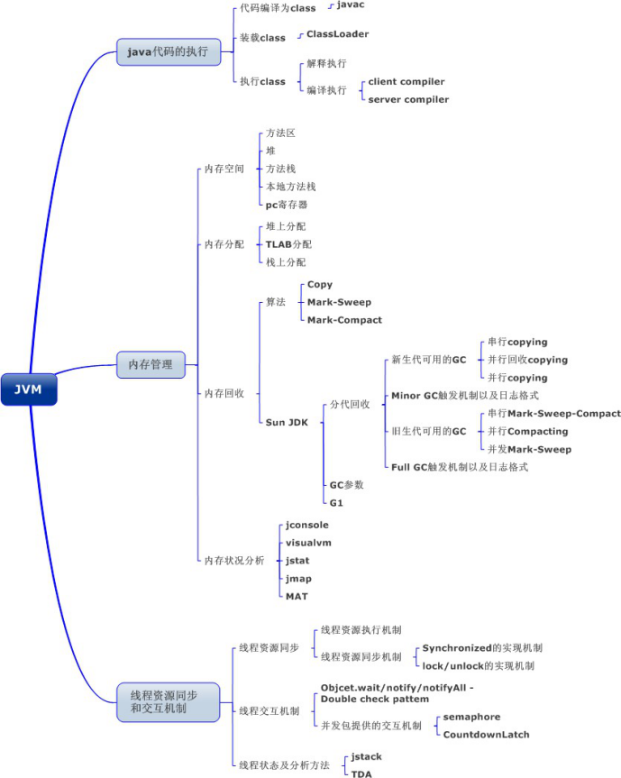
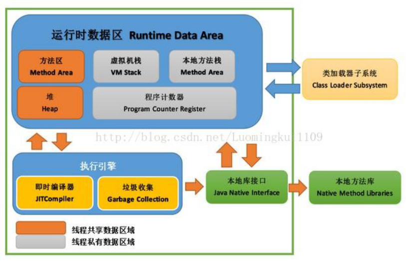

**基本概念** 

> JVM是Java Virtual Machine（Java虚拟机）的缩写，JVM是一种用于计算设备的规范，它是一个虚构出来的计算机，是通过在实际的计算机上仿真模拟各种计算机功能来实现的。JVM 是可运行 Java 代码的假想计算机 ，包括一套字节码指令集、一组寄存器、一个栈、一个垃圾回收，堆 和 一个存储方法域。JVM 是运行在操作系统之上的，它与硬件没有直接的交互。

>

------

> 我们都知道 Java 源文件，通过编译器，能够生产相应的.Class 文件，也就是字节码文件， 而字节码文件又通过 Java 虚拟机中的解释器，编译成特定机器上的机器码 。 

> 也就是如下： 

> ① Java 源文件—->编译器—->字节码文件 

> ② 字节码文件—->JVM—->机器码 每一种平台的解释器是不同的，

> 但是实现的虚拟机是相同的，这也就是 Java 为什么能够 跨平台的原因了 ，当一个程序从开始运行，这时虚拟机就开始实例化了，多个程序启动就会 存在多个虚拟机实例。程序退出或者关闭，则虚拟机实例消亡，多个虚拟机实例之间数据不 能共享。

>

