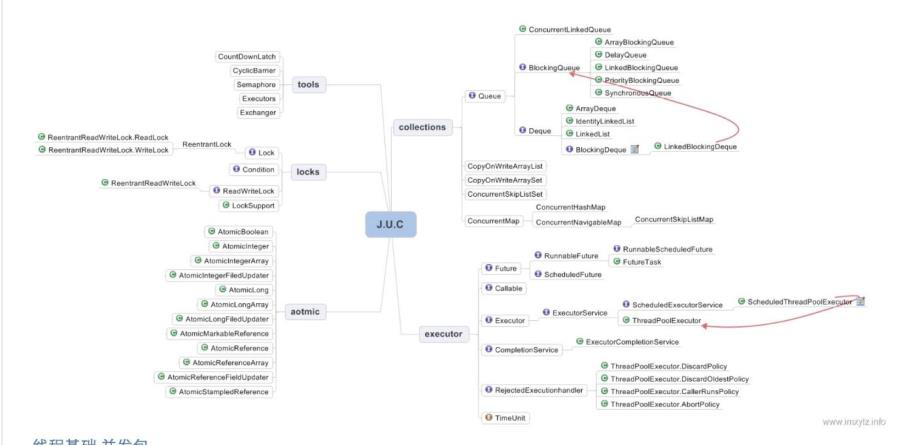
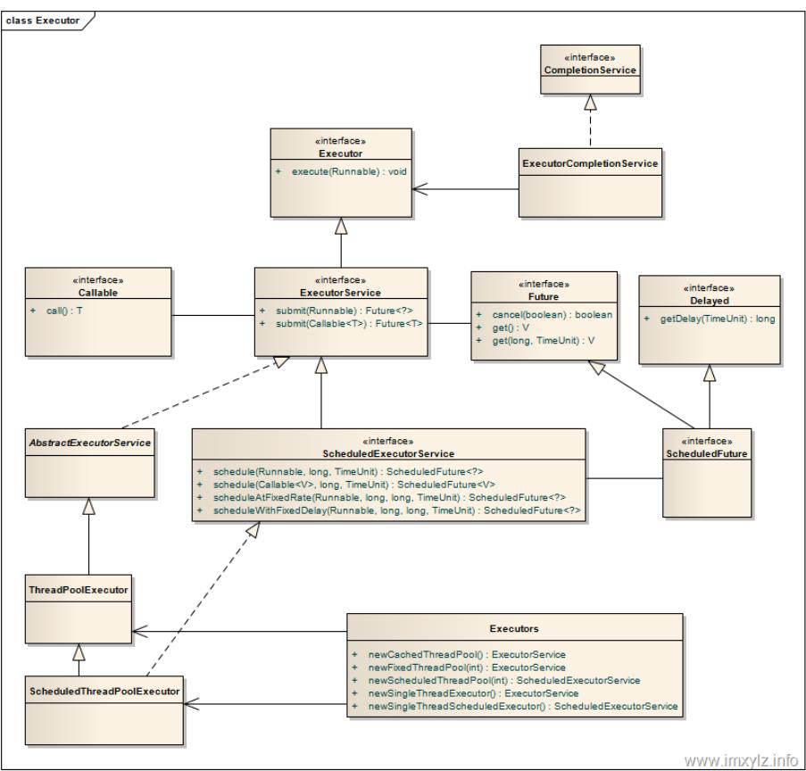

## 3.1. JAVA 并发知识库



## 3.2. JAVA 线程实现/创建方式

### 3.2.1. 继承 Thread 类 

​		Thread 类本质上是实现了 Runnable 接口的一个实例，代表一个线程的实例。启动线程的唯一方 法就是通过 Thread 类的 start()实例方法。start()方法是一个 native 方法，它将启动一个新线 程，并执行 run()方法。

```java
public class MyThread extends Thread {
 public void run() {
 	System.out.println("MyThread.run()");
 }
    MyThread myThread1 = new MyThread();
	myThread1.start(); 
}
```

### 3.2.2. 实现 Runnable 接口。 

​		如果自己的类已经 extends 另一个类，就无法直接 extends Thread，此时，可以实现一个 Runnable 接口。

```java
public class MyThread extends OtherClass implements Runnable {
 	public void run() {
 		System.out.println("MyThread.run()");
 	}
} 
    //启动 MyThread，需要首先实例化一个 Thread，并传入自己的 MyThread 实例：
    MyThread myThread = new MyThread();
    Thread thread = new Thread(myThread);
    thread.start();
    //事实上，当传入一个 Runnable target 参数给 Thread 后，Thread 的 run()方法就会调用
    target.run()
public void run() {
 	if (target != null) {
	 	target.run();
 	}
}
```

### 3.2.3. ExecutorService、Callable、Future 有返回值线程 

​		有返回值的任务必须实现 Callable 接口，类似的，无返回值的任务必须 Runnable 接口。执行 Callable 任务后，可以获取一个 Future 的对象，在该对象上调用 get 就可以获取到 Callable 任务 返回的 Object 了，再结合线程池接口 ExecutorService 就可以实现传说中有返回结果的多线程 了。

```java
//创建一个线程池
ExecutorService pool = Executors.newFixedThreadPool(taskSize);
// 创建多个有返回值的任务
List<Future> list = new ArrayList<Future>();
for (int i = 0; i < taskSize; i++) {
Callable c = new MyCallable(i + " ");
// 执行任务并获取 Future 对象
Future f = pool.submit(c);
list.add(f);
}
// 关闭线程池
pool.shutdown();
// 获取所有并发任务的运行结果
for (Future f : list) {
// 从 Future 对象上获取任务的返回值，并输出到控制台
System.out.println("res：" + f.get().toString());
}
```

### 3.2.4. 基于线程池的方式 

​		线程和数据库连接这些资源都是非常宝贵的资源。那么每次需要的时候创建，不需要的时候销 毁，是非常浪费资源的。那么我们就可以使用缓存的策略，也就是使用线程池。

```java
// 创建线程池
 ExecutorService threadPool = Executors.newFixedThreadPool(10);
 while(true) {
 threadPool.execute(new Runnable() { // 提交多个线程任务，并执行
 @Override
 public void run() {
 	System.out.println(Thread.currentThread().getName() + " is running ..");
 	try {
 		Thread.sleep(3000);
 	} catch (InterruptedException e) {
 		e.printStackTrace();
 	}
 }
```

## 3. 3.种线程池 

​	Java 里面线程池的顶级接口是 Executor，但是严格意义上讲 Executor 并不是一个线程池，而 只是一个执行线程的工具。真正的线程池接口是 ExecutorService。




### 3.3.1. newCachedThreadPool 

​		创建一个可根据需要创建新线程的线程池，但是在以前构造的线程可用时将重用它们。对于执行 很多短期异步任务的程序而言，这些线程池通常可提高程序性能。调用 execute 将重用以前构造 的线程（如果线程可用）。如果现有线程没有可用的，则创建一个新线程并添加到池中。终止并 从缓存中移除那些已有 60 秒钟未被使用的线程。因此，长时间保持空闲的线程池不会使用任何资 源。

###  3.3.2. newFixedThreadPool 

​		创建一个可重用固定线程数的线程池，以共享的无界队列方式来运行这些线程。在任意点，在大 多数 nThreads 线程会处于处理任务的活动状态。如果在所有线程处于活动状态时提交附加任务， 则在有可用线程之前，附加任务将在队列中等待。如果在关闭前的执行期间由于失败而导致任何 线程终止，那么一个新线程将代替它执行后续的任务（如果需要）。在某个线程被显式地关闭之 前，池中的线程将一直存在。

### 3.3.3. newScheduledThreadPool 

​		创建一个线程池，它可安排在给定延迟后运行命令或者定期地执行。

```java
ScheduledExecutorService scheduledThreadPool= Executors.newScheduledThreadPool(3);
 scheduledThreadPool.schedule(newRunnable(){
 	@Override
 	public void run() {
 		System.out.println("延迟三秒");
 	}}, 3, TimeUnit.SECONDS);
	
	scheduledThreadPool.scheduleAtFixedRate(newRunnable(){
 	@Override
	public void run() {
 		System.out.println("延迟 1 秒后每三秒执行一次");
 	}},1,3,TimeUnit.SECONDS);
```

### 3.3.4. newSingleThreadExecutor

​		 Executors.newSingleThreadExecutor()返回一个线程池（这个线程池只有一个线程）,这个线程 池可以在线程死后（或发生异常时）重新启动一个线程来替代原来的线程继续执行下去！

## 3.4. 线程生命周期(状态) 

​		当线程被创建并启动以后，它既不是一启动就进入了执行状态，也不是一直处于执行状态。 在线程的生命周期中，它要经过**新建(New)、就绪（Runnable）、运行（Running）、阻塞 (Blocked)和死亡(Dead)**5 种状态。尤其是当线程启动以后，它不可能一直"霸占"着 CPU 独自 运行，所以 CPU 需要在多条线程之间切换，于是线程状态也会多次在运行、阻塞之间切换 

### 3.4.1. 新建状态（NEW） 

​		当程序**使用 new 关键字创建**了一个线程之后，该线程就处于新建状态，此时仅由 JVM 为其分配 内存，并初始化其成员变量的值

### 3.4.2. 就绪状态（RUNNABLE） 

​		当线程对象**调用了 start()方法**之后，该线程处于就绪状态。Java 虚拟机会为其创建方法调用栈和 程序计数器，等待调度运行。 

### 3.4.3. 运行状态（RUNNING）

​		 如果处于就绪状态的**线程获得了 CPU，开始执行 run()方法的线程执行体，则该线程处于运行状 态**。 

### 3.4.4. 阻塞状态（BLOCKED）

​		**阻塞状态是指线程因为某种原因放弃了 cpu 使用权，也即让出了 cpu timeslice，暂时停止运行**。 直到线程进入可运行(runnable)状态，才有机会再次获得 cpu timeslice 转到运行(running)状 态。**阻塞的情况分三种**：

​		**等待阻塞（o.wait->等待对列）**： 运行(running)的线程执行 o.wait()方法，JVM 会把该线程放入等待队列(waitting queue) 中。 

​		**同步阻塞（lock->锁池）**： 运行(running)的线程在获取对象的同步锁时，若该同步锁被别的线程占用，则 JVM 会把该线 程放入锁池(lock pool)中。 

​		**其他阻塞（sleep/join）** ：运行(running)的线程执行 Thread.sleep(long ms)或 t.join()方法，或者发出了 I/O 请求时， JVM 会把该线程置为阻塞状态。当 sleep()状态超时、join()等待线程终止或者超时、或者 I/O 处理完毕时，线程重新转入可运行(runnable)状态。

### 3.4.5. 线程死亡（DEAD） 

​		**线程会以下面三种方式结束，结束后就是死亡状态**。 

​		**正常结束** 	

​			run()或 call()方法执行完成，线程正常结束。 

​		**异常结束** 

​			线程抛出一个未捕获的 Exception 或 Error。 

​		**调用 stop** 

​			直接调用该线程的 stop()方法来结束该线程—该方法通常容易导致死锁，不推荐使用。

## 3.5. 终止线程 4 种方式

### 3.5.1. 正常运行结束 

​		程序运行结束，线程自动结束。 

### 3.5.2. 使用退出标志退出线程

​		 一般 run()方法执行完，线程就会正常结束，然而，常常有些线程是伺服线程。它们需要长时间的 运行，只有在外部某些条件满足的情况下，才能关闭这些线程。使用一个变量来控制循环，例如： 最直接的方法就是设一个 boolean 类型的标志，并通过设置这个标志为 true 或 false 来控制 while 循环是否退出，代码示例：

```java
public class ThreadSafe extends Thread {
 	public volatile boolean exit = false;
 	public void run() {
 		while (!exit){
 		//do something
 	}
 }
```

​		定义了一个退出标志 exit，当 exit 为 true 时，while 循环退出，exit 的默认值为 false.在定义 exit 时，使用了一个 **Java 关键字 volatile，这个关键字的目的是使 exit 同步**，也就是说在同一时刻只 能由一个线程来修改 exit 的值。

### 3.5.3. Interrupt 方法结束线程 

​		使用 interrupt()方法来中断线程有两种情况：

​			**1.线程处于阻塞状态**：如使用了 sleep,同步锁的 wait,socket 中的 receiver,accept 等方法时， 会使线程处于阻塞状态。当调用线程的 interrupt()方法时，会抛出 InterruptException 异常。 阻塞中的那个方法抛出这个异常，通过代码捕获该异常，然后 break 跳出循环状态，从而让 我们有机会结束这个线程的执行。通常很多人认为只要调用 interrupt 方法线程就会结束，实 际上是错的， 一定要先捕获 InterruptedException 异常之后通过 break 来跳出循环，才能正 常结束 run 方法。 

​			**2. 线程未处于阻塞状态**：使用 isInterrupted()判断线程的中断标志来退出循环。当使用 interrupt()方法时，中断标志就会置 true，和使用自定义的标志来控制循环是一样的道理。

```java
 public class ThreadSafe extends Thread {
	 public void run() {
 		while (!isInterrupted()){ //非阻塞过程中通过判断中断标志来退出
 		try{
 			Thread.sleep(5*1000);//阻塞过程捕获中断异常来退出
 		}catch(InterruptedException e){
 			e.printStackTrace();
 			break;//捕获到异常之后，执行 break 跳出循环
 		}
 	}
 }
```

### 3.5.4. stop 方法终止线程（线程不安全） 

​		程序中可以直接使用 thread.stop()来强行终止线程，但是 stop 方法是很危险的，就象突然关 闭计算机电源，而不是按正常程序关机一样，可能会产生不可预料的结果，不安全主要是： thread.stop()调用之后，创建子线程的线程就会抛出 ThreadDeatherror 的错误，并且会释放子 线程所持有的所有锁。一般任何进行加锁的代码块，都是为了保护数据的一致性，如果在调用 thread.stop()后导致了该线程所持有的所有锁的突然释放(不可控制)，那么被保护数据就有可能呈 现不一致性，其他线程在使用这些被破坏的数据时，有可能导致一些很奇怪的应用程序错误。因 此，并**不推荐使用 stop 方法来终止线程**。


## 3.6. sleep 与 wait 区别 

​		1. 对于 sleep()方法，我们首先要知道该方法是属于 Thread 类中的。而 wait()方法，则是属于 Object 类中的。

​        2. sleep()方法导致了程序暂停执行指定的时间，让出 cpu 该其他线程，但是他的监控状态依然 保持者，当指定的时间到了又会自动恢复运行状态。 

​		3.在调用 sleep()方法的过程中，线程不会释放对象锁。 4. 而当调用 wait()方法的时候，线程会放弃对象锁，进入等待此对象的等待锁定池，只有针对此 对象调用 notify()方法后本线程才进入对象锁定池准备获取对象锁进入运行状态。

​		4.而当调用 wait()方法的时候，线程会放弃对象锁，进入等待此对象的等待锁定池，只有针对此 对象调用 notify()方法后本线程才进入对象锁定池准备获取对象锁进入运行状态。

## 3.7. start 与 run 区别

​		 1. start（）方法来启动线程，真正实现了多线程运行。这时无需等待 run 方法体代码执行完毕， 可以直接继续执行下面的代码。

​		 2.通过调用 Thread 类的 start()方法来启动一个线程， 这时此线程是处于就绪状态， 并没有运 行。 

​		 3.方法 run()称为线程体，它包含了要执行的这个线程的内容，线程就进入了运行状态，开始运 行 run 函数当中的代码。 Run 方法运行结束， 此线程终止。然后 CPU 再调度其它线程。

## 3.8. JAVA 后台线程 

​		**1. 定义**：守护线程--也称“服务线程”，他是后台线程，它有一个特性，即为用户线程 提供 公 共服务，在没有用户线程可服务时会自动离开。

​        **2. 优先级**：守护线程的优先级比较低，用于为系统中的其它对象和线程提供服务。 

​		**3.设置**：通过 setDaemon(true)来设置线程为“守护线程”；将一个用户线程设置为守护线程 的方式是在 线程对象创建 之前 用线程对象的 setDaemon 方法。 

​        **4.在 Daemon** 线程中产生的新线程也是 Daemon 的。 

​        **5.线程则是 JVM 级别的**，以 Tomcat 为例，如果你在 Web 应用中启动一个线程，这个线程的 生命周期并不会和 Web 应用程序保持同步。也就是说，即使你停止了 Web 应用，这个线程 依旧是活跃的。

​        **6.example: 垃圾回收线程**就是一个经典的守护线程，当我们的程序中不再有任何运行的Thread, 程序就不会再产生垃圾，垃圾回收器也就无事可做，所以当垃圾回收线程是 JVM 上仅剩的线 程时，垃圾回收线程会自动离开。它始终在低级别的状态中运行，用于实时监控和管理系统 中的可回收资源。 

​        7.生命周期：守护进程（Daemon）是运行在后台的一种特殊进程。它独立于控制终端并且周 期性地执行某种任务或等待处理某些发生的事件。也就是说守护线程不依赖于终端，但是依 赖于系统，与系统“同生共死”。当 JVM 中所有的线程都是守护线程的时候，JVM 就可以退 出了；如果还有一个或以上的非守护线程则 JVM 不会退出。
