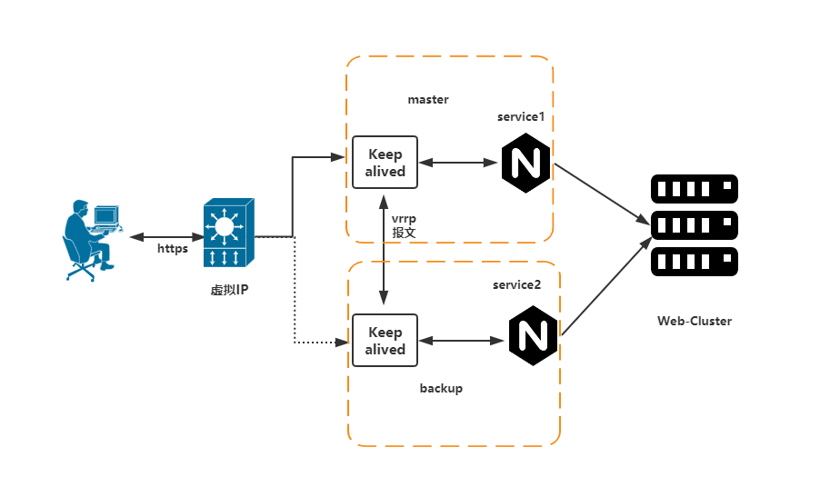
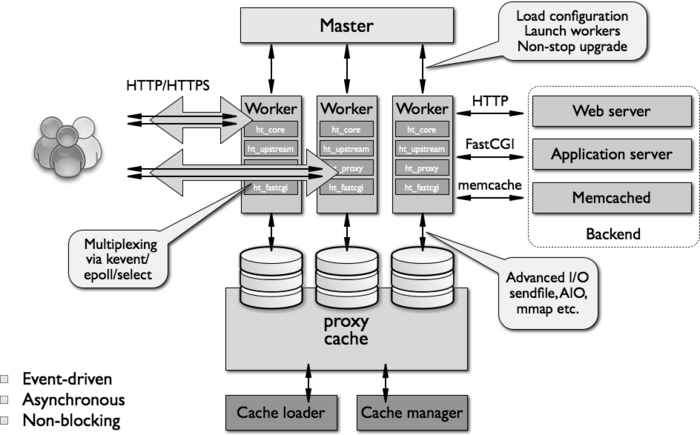

# Nginx 学习一路向西

>  Java大猿帅成长手册，**GitHub** [JavaEgg](https://github.com/Jstarfish/JavaEgg) ，N线互联网开发必备技能兵器谱

## 1. Nginx简介 

### 1.1 Nginx 概述 

- NGINX是一个免费、开源、高性能、轻量级的HTTP和反向代理服务器，也是一个电子邮件（IMAP/POP3）代理服务器，其特点是占有内存少，并发能力强。 Nginx 因为它的稳定性、丰富的模块库、灵活的配置和较低的资源消耗而闻名 。目前应该是几乎所有项目建设必备。

- Nginx由内核和一系列模块组成，内核提供web服务的基本功能，如启用网络协议，创建运行环境，接收和分配客户端请求，处理模块之间的交互。Nginx的各种功能和操作都由模块来实现。Nginx的模块从结构上分为核心模块、基础模块和第三方模块。

  核心模块： HTTP模块、EVENT模块和MAIL模块

  基础模块： HTTP Access模块、HTTP FastCGI模块、HTTP Proxy模块和HTTP Rewrite模块

  第三方模块： HTTP Upstream Request Hash模块、Notice模块和HTTP Access Key模块及用户自己开发的模块

  这样的设计使Nginx方便开发和扩展，也正因此才使得Nginx功能如此强大。Nginx的模块默认编译进nginx中，如果需要增加或删除模块，需要重新编译Nginx,这一点不如Apache的动态加载模块方便。如果有需要动态加载模块，可以使用由淘宝网发起的web服务器Tengine，在nginx的基础上增加了很多高级特性，完全兼容Nginx，已被国内很多网站采用。

- Nginx有很多扩展版本

  - 开源版  [nginx.org](http://nginx.org/)
  - 商业版 [NGINX Plus](https://www.nginx.com/)
  - 淘宝网发起的Web服务器 [Tengine](http://tengine.taobao.org/)
  - 基于Nginx和Lua的Web平台 [OpenResty](http://openresty.org/cn/)


### 1.2 Nginx 作为 web 服务器 

Web服务器也称为WWW(WORLD WIDE WEB)服务器，主要功能是提供网上信息浏览服务，常常以B/S（Browser/Server）方式提供服务。

- 应用层使用HTTP协议。
- HTML文档格式。
- 浏览器统一资源定位器(URL)。

Nginx 可以作为静态页面的 web 服务器，同时还支持 CGI 协议的动态语言，比如 perl、php 等，但是不支持 java。Java 程序一般都通过与 Tomcat 配合完成。

作为一名Java猿帅，肯定要理解下Nginx和Tomcat的区别了：

**Nginx、Apache和Tomcat**

- Nginx—— 由俄罗斯程序员Igor Sysoev所开发的轻量级、高并发HTTP服务器；

- [Apache HTTP Server Project](httpd.apache.org/)，一个Apache基金会下的HTTP服务项目，和Nginx功能类似；

- [Apache Tomcat]( http://tomcat.apache.org/ ) ，则是Apache基金会下的另外一个项目，是一个**Application Server**，更准确的说是一个

  servlet应用容器，与Apache HTTP Server和Nginx相比，Tomcat能够**动态**的生成资源并返回到客户端；

Apache HTTP Server和Nginx本身不支持生成动态页面，但它们可以通过其他模块来支持（例如通过Shell、PHP、Python脚本程序来动态生成内容）；

一个 HTTP Server 关心的是 HTTP 协议层面的传输和访问控制，所以在 Apache/Nginx 上你可以看到代理、负载均衡等功能。客户端通过 HTTP Server 访问服务器上存储的资源（HTML 文件、图片文件等等）。通过 CGI 技术，也可以将处理过的内容通过 HTTP Server 分发，但是一个 HTTP Server 始终只是把服务器上的文件如实的通过 HTTP 协议传输给客户端。

而应用服务器，则是一个应用执行的容器。它首先需要支持开发语言的运行（对于 Tomcat 来说，就是 Java），保证应用能够在应用服务器上正常运行。其次，需要支持应用相关的规范，例如类库、安全方面的特性。对于 Tomcat 来说，就是需要提供 JSP/Sevlet 运行需要的标准类库、Interface 等。为了方便，应用服务器往往也会集成 HTTP Server 的功能，但是不如专业的 HTTP Server 那么强大，所以应用服务器往往是运行在 HTTP Server 的背后，执行应用，将动态的内容转化为静态的内容之后，通过 HTTP Server 分发到客户端。


### 1.3 正向代理 

正向代理：如果把局域网外的 Internet 想象成一个巨大的资源库，则局域网中的客户端要访 问 Internet，则需要通过代理服务器来访问，这种代理服务就称为正向代理。  

**正向代理“代理”的是客户端**。

比如你想去google看个“动作片”，可国内不允许呀，就需要找翻墙代理，这个就是所谓的”正向代理“。


### 1.4 反向代理 与 负载均衡

 反向代理正好与正向代理相反，反向代理是指以代理服务器来接收Internet上的连接请求，然后将请求转发到内部网络上的服务器，并将服务器上得到的结果返回给客户端，此时代理服务器对外表现就是一个服务器，客户端对代理是无感知的。

**反向代理“代理”的是服务端**。

再比如，你想本本分分的在“优酷”上看个“爱情片”，youku.com会把你的请求分发到存放片片的那台机器上，这个就是所谓的”反向代理“。


**为什么使用反向代理**

- 保护和隐藏原始资源服务器
- 加密和SSL加速 
- 通过缓存静态资源，加速Web请求
- 实现负载均衡

#### **负载均衡**

TODO: 留一个负载均衡详细介绍传送门


#### 地址重定向

Nginx 的Rewrite主要的功能就是实现URL重写

比如输入360.com  跳转到了360.cn，baidu.cn跳转到了baidu.com


### 1.5 动静分离 

为了加快网站的解析速度，可以把动态页面和静态页面由不同的服务器来解析，加快解析速度，降低原来单个服务器的压力。 这里指的就是让动态程序（Java、PHP）去访问应用服务器，让缓存、图片、JS、CSS等去访问Nginx。

------


## 2. Nginx 安装  

1. [下载Nginx](http://nginx.org/)  

   ```sh
   wget http://nginx.org/download/nginx-1.16.1.tar.gz 
   ```

2. 安装需要编译的插件 

   - 用于编译c、c++代码的GCC；

   - 用c语言编写的正则表达式函数库Pcre(使用rewrite模块)；

   - 用于数据压缩的函式库的Zlib；

   - 安全套接字层密码库OpenSSL（启用SSL支持）

   ```sh
   yum install gcc c++                                          
   yum install -y pcre pcre-devel                          
   yum install -y zlib zlib-devel                           
   yum install -y openssl openssl-devel   
   ```

3. 解压、配置（Nginx支持各种配置选项,文末一一列出 [Nginx配置选项](#Nginx配置选项) ）、编译、安装nginx

   ```sh
   tar -zxvf nginx-1.15.tar.gz cd nginx-1.16.1
   cd nginx-1.16.1
   ./configure
   make && sudo make install 
   ```
   
4. 启动、重启、关闭

   ```sh
   cd /usr/local/nginx/ 
   cd sbin
   ./nginx
   #关闭命令 
   ./nginx -s stop
   #重启，热部署
   ./nginx -s reload
   #修改配置文件后也别嘚瑟，反正我会动不动就写错，检查修改的nginx.conf配置是否正确
   ./nginx -t
   ```

   

5. 验证（浏览器输入ip）

   

------


## 3. 配置文件

nginx.conf 配置文件主要分为三部分：全局块、events块、https块。

**Nginx配置语法：**

- 配置文件由指令和指令块构成
- 每条指令以分号（;）结尾，指令和参数间以空格符分隔
- 指令块以大括号{}将多条指令组织在一起
- include语句允许组合多个配置文件以提高可维护性
- 使用 # 添加注释
- 使用 $ 定义变量
- 部分指令的参数支持正则表达式

#### 3.1 全局块

全局配置部分用来配置对整个server都有效的参数。主要会设置一些影响 nginx 服务器整体运行的配置指令，主要包括配置运行 Nginx 服务器的用户（组）、允许生成的 worker process 数，进程 PID 存放路径、日志存放路径和类型以 及配置文件的引入等。 示例：

```
user nobody;
worker_processes  4;
error_log  /data/nginx/logs/error.log  notice; 
```

#### 3.2 events 块 

events 块涉及的指令主要影响 Nginx 服务器与用户的网络连接，常用的设置包括是否开启对多 work process 下的网络连接进行序列化，是否允许同时接收多个网络连接，选取哪种事件驱动模型来处理连接请求，每个 word process 可以同时支持的最大连接数等。

```
events {
	#每个 work process 支持的最大连接数为 1024.
    worker_connections  1024;
}
```

#### 3.3 http 块  

这算是 Nginx 服务器配置中最频繁的部分，代理、缓存和日志定义等绝大多数功能和第三方模块的配置都在这里。 需要注意的是：http 块也可以包括 http 全局块、server 块。

##### 3.3.1 http 全局块 

http 全局块配置的指令包括文件引入、MIME-TYPE 定义、日志自定义、连接超时时间、单链接请求数上限等。 

    http {
        include       mime.types;
        default_type  application/octet-stream;
    	sendfile        on;
    	keepalive_timeout  65;

##### 3.3.2 server 块 

这块和虚拟主机有密切关系，虚拟主机从用户角度看，和一台独立的硬件主机是完全一样的，该技术的产生是为了 节省互联网服务器硬件成本。

每个 http 块可以包括多个 server 块，而每个 server 块就相当于一个虚拟主机。 

而每个 server 块也分为全局 server 块，以及可以同时包含多个 locaton 块。

- **全局 server 块** 

  也被叫做“虚拟服务器”部分，它描述的是一组根据不同server_name指令逻辑分割的资源，这些虚拟服务器响应HTTP请求，因此都包含在http部分。最常见的配置是本虚拟机主机的监听配置和本虚拟主机的名称或 IP 配置。

      server {
        listen       80;
        #server_name也支持通配符，*.example.com、www.example.*、.example.com
        server_name  localhost;
        #charset koi8-r;
        #access_log  logs/host.access.log  main;

- **location 块** 

  一个 server 块可以配置多个 location 块。

  这块的主要作用是基于 Nginx 服务器接收到的请求字符串（例如 server_name/uri-string），对虚拟主机名称 （也可以是 IP 别名）之外的字符串（例如 前面的 /uri-string）进行匹配，对特定的请求进行处理。地址定向、数据缓存和应答控制等功能，还有许多第三方模块的配置也在这里进行。

   **location 指令说明** 
  
  该指令用于匹配 URL。
  
   语法如下：`location [ = | ~ | ~* | ^~] uri{}`
  
  - = ：该修饰符使用精确匹配并且终止搜索。 
  - ~：该修饰符使用区分大小写的正则表达式匹配。 
  - ~*：该修饰符使用不区分大小写的正则表达式匹配。
  - ^~：用于不含正则表达式的 uri 前，要求 Nginx 服务器找到标识 uri 和请求字 符串匹配度最高的 location 后，立即使用此 location 处理请求，而不再使用 location 块中的正则 uri 和请求字符串做匹配。
  
   ?> **Tip**  注意：如果 uri 包含正则表达式，则必须要有 ~ 或者 ~* 标识。 
  
  当一个请求进入时，URI将会被检测匹配一个最佳的location。
  
  - 没有正则表达式的location被作为最佳的匹配，独立于含有正则表达式的location顺序；
  - **在配置文件中按照查找顺序进行正则表达式匹配**。在查找到第一个正则表达式匹配之后结束查找。由这个最佳的location提供请求处理。
  
  ```
   location / {
   	root   html;
      index  index.html index.htm;
      }
    
    #error_page  404              /404.html;
    
    # redirect server error pages to the static page /50x.html
    #
    error_page   500 502 503 504  /50x.html;
    location = /50x.html {
    	root   html;
    }
    location / {
        #try_files指令将会按照给定的参数顺序进行匹配尝试
        try_files $uri $uri/ /index.html;
    }
  ```


#### nginx.conf 详细配置

    #定义Nginx运行的用户和用户组
    user www www; 
    
    #nginx进程数，通常设置成和cpu的数量相等
    worker_processes 4; 
    
    #全局错误日志定义类型，[debug | info | notice | warn | error | crit]
    #error_log  /data/nginx/logs/error.log;
    #error_log  /data/nginx/logs/error.log  notice;
    
    #日志文件存放路径 access_log path [format [buffer=size | off]]
    access_log /data/nginx/logs/lazyegg.com/web/access.log combinedio;
    
    #进程pid文件
    #pid        logs/nginx.pid;
    
    #指定进程可以打开的最大描述符：数目
    #工作模式与连接数上限
    ##这个指令是指当一个nginx进程打开的最多文件描述符数目，理论值应该是最多打开文件数（ulimit -n）与nginx进程数相除，但是nginx分配请求并不是那么均匀，所以最好与ulimit -n 的值保持一致。
    #这是因为nginx调度时分配请求到进程并不是那么的均衡，所以假如填写10240，总并发量达到3-4万时就有进程可能超过10240了，这时会返回502错误。
    worker_rlimit_nofile 65535;
    
    #################################  events  ###############################
    events {
        #参考事件模型，use [ kqueue | rtsig | epoll | /dev/poll | select | poll ]; epoll模型
        use epoll
        #单个进程最大连接数（最大连接数=连接数+进程数）
        worker_connections  1024;
        
        #keepalive 超时时间
        keepalive_timeout 60;
        
        #客户端请求头部的缓冲区大小。
        client_header_buffer_size 4k;
        
        #这个将为打开文件指定缓存，默认是没有启用的，max指定缓存数量，建议和打开文件数一致，inactive是指经过多长时间文件没被请求后删除缓存。
        open_file_cache max=65535 inactive=60s;
        #这个是指多长时间检查一次缓存的有效信息。
        open_file_cache_valid 80s;
        #open_file_cache指令中的inactive参数时间内文件的最少使用次数，如果超过这个数字，文件描述符一直是在缓存中打开的，如上例，如果有一个文件在inactive时间内一次没被使用，它将被移除。
        open_file_cache_min_uses 1;
        
        #语法:open_file_cache_errors on | off 默认值:open_file_cache_errors off 使用字段:http, server, location 这个指令指定是否在搜索一个文件是记录cache错误.
        open_file_cache_errors on;
    }
    
    ##############################   http    ##################################
    
    #设定http服务器，利用它的反向代理功能提供负载均衡支持
    http{
        #文件扩展名与文件类型映射表
        include mime.types;
        
        #默认文件类型
        default_type application/octet-stream;
        
        #默认编码
        charset utf-8;
        
        #服务器名字的hash表大小
        server_names_hash_bucket_size 128;
        
        #客户端请求头部的缓冲区大小。
        client_header_buffer_size 32k;
        
        #客户请求头缓冲大小。
        large_client_header_buffers 4 64k;
        
        #允许客户端请求的最大单个文件字节数
        client_max_body_size 8m;
        
        #开启高效文件传输模式，sendfile指令指定nginx是否调用sendfile函数来输出文件，对于普通应用设为 on，如果用来进行下载等应用磁盘IO重负载应用，可设置为off，以平衡磁盘与网络I/O处理速度，降低系统的负载。注意：如果图片显示不正常把这个改成off。
        sendfile on;
        
        #开启目录列表访问，适合下载服务器，默认关闭。
        autoindex on;
        
        #此选项允许或禁止使用socke的TCP_CORK的选项，此选项仅在使用sendfile的时候使用
        tcp_nopush on;
         
        tcp_nodelay on;
        
        #长连接超时时间，单位是秒
        keepalive_timeout 120;
        
        #FastCGI相关参数是为了改善网站的性能：减少资源占用，提高访问速度。下面参数看字面意思都能理解。
        fastcgi_connect_timeout 300;
        fastcgi_send_timeout 300;
        fastcgi_read_timeout 300;
        fastcgi_buffer_size 64k;
        fastcgi_buffers 4 64k;
        fastcgi_busy_buffers_size 128k;
        fastcgi_temp_file_write_size 128k;
        
        #gzip模块设置
        gzip on; #开启gzip压缩输出
        gzip_min_length 1k;    #最小压缩文件大小
        gzip_buffers 4 16k;    #压缩缓冲区
        gzip_http_version 1.0; #压缩版本（默认1.1，前端如果是squid2.5请使用1.0）
        gzip_comp_level 2;     #压缩等级
        gzip_types text/plain application/x-javascript text/css application/xml;    #压缩类型，默认就已经包含textml，所以下面就不用再写了，写上去也不会有问题，但是会有一个warn。
        gzip_vary on;
    
        #开启限制IP连接数的时候需要使用
        #limit_zone crawler $binary_remote_addr 10m;
        
        #负载均衡配置
        upstream lazyegg.net {
      
            #upstream的负载均衡，weight是权重，可以根据机器配置定义权重。weigth参数表示权值，权值越高被分配到的几率越大。
            server 192.168.80.121:80 weight=3;
            server 192.168.80.122:80 weight=2;
            server 192.168.80.123:80 weight=3;
    
            #nginx的upstream目前支持4种方式的分配
            #1、轮询（默认）
            #每个请求按时间顺序逐一分配到不同的后端服务器，如果后端服务器down掉，能自动剔除。
            #2、weight
            #指定轮询几率，weight和访问比率成正比，用于后端服务器性能不均的情况。
            #例如：
            #upstream bakend {
            #    server 192.168.0.14 weight=10;
            #    server 192.168.0.15 weight=10;
            #}
            #2、ip_hash
            #每个请求按访问ip的hash结果分配，这样每个访客固定访问一个后端服务器，可以解决session的问题。
            #例如：
            #upstream bakend {
            #    ip_hash;
            #    server 192.168.0.14:88;
            #    server 192.168.0.15:80;
            #}
            #3、fair（第三方）
            #按后端服务器的响应时间来分配请求，响应时间短的优先分配。
            #upstream backend {
            #    server server1;
            #    server server2;
            #    fair;
            #}
            #4、url_hash（第三方）
            #按访问url的hash结果来分配请求，使每个url定向到同一个后端服务器，后端服务器为缓存时比较有效。
            #例：在upstream中加入hash语句，server语句中不能写入weight等其他的参数，hash_method是使用的hash算法
            #upstream backend {
            #    server squid1:3128;
            #    server squid2:3128;
            #    hash $request_uri;
            #    hash_method crc32;
            #}
    
            #tips:
            #upstream bakend{#定义负载均衡设备的Ip及设备状态}{
            #    ip_hash;
            #    server 127.0.0.1:9090 down;
            #    server 127.0.0.1:8080 weight=2;
            #    server 127.0.0.1:6060;
            #    server 127.0.0.1:7070 backup;
            #}
            #在需要使用负载均衡的server中增加 proxy_pass http://bakend/;
    
            #每个设备的状态设置为:
            #1.down表示单前的server暂时不参与负载
            #2.weight为weight越大，负载的权重就越大。
            #3.max_fails：允许请求失败的次数默认为1.当超过最大次数时，返回proxy_next_upstream模块定义的错误
            #4.fail_timeout:max_fails次失败后，暂停的时间。
            #5.backup： 其它所有的非backup机器down或者忙的时候，请求backup机器。所以这台机器压力会最轻。
    
            #nginx支持同时设置多组的负载均衡，用来给不用的server来使用。
            #client_body_in_file_only设置为On 可以讲client post过来的数据记录到文件中用来做debug
            #client_body_temp_path设置记录文件的目录 可以设置最多3层目录
            #location对URL进行匹配.可以进行重定向或者进行新的代理 负载均衡
        }
        
         #虚拟主机的配置
        server {
            #监听端口
            listen 80;
    
            #域名可以有多个，用空格隔开
            server_name lazyegg.net;
            #默认入口文件名称
            index index.html index.htm index.php;
            root /data/www/lazyegg;
    
            #对******进行负载均衡
            location ~ .*.(php|php5)?$
            {
                fastcgi_pass 127.0.0.1:9000;
                fastcgi_index index.php;
                include fastcgi.conf;
            }
             
            #图片缓存时间设置
            location ~ .*.(gif|jpg|jpeg|png|bmp|swf)$
            {
                expires 10d;
            }
             
            #JS和CSS缓存时间设置
            location ~ .*.(js|css)?$
            {
                expires 1h;
            }
             
            #日志格式设定
            #$remote_addr与$http_x_forwarded_for用以记录客户端的ip地址；
            #$remote_user：用来记录客户端用户名称；
            #$time_local： 用来记录访问时间与时区；
            #$request： 用来记录请求的url与http协议；
            #$status： 用来记录请求状态；成功是200，
            #$body_bytes_sent ：记录发送给客户端文件主体内容大小；
            #$http_referer：用来记录从那个页面链接访问过来的；
            #$http_user_agent：记录客户浏览器的相关信息；
            #通常web服务器放在反向代理的后面，这样就不能获取到客户的IP地址了，通过$remote_add拿到的IP地址是反向代理服务器的iP地址。反向代理服务器在转发请求的http头信息中，可以增加x_forwarded_for信息，用以记录原有客户端的IP地址和原来客户端的请求的服务器地址。
            log_format access '$remote_addr - $remote_user [$time_local] "$request" '
            '$status $body_bytes_sent "$http_referer" '
            '"$http_user_agent" $http_x_forwarded_for';
             
            #定义本虚拟主机的访问日志
            access_log  /usr/local/nginx/logs/host.access.log  main;
            access_log  /usr/local/nginx/logs/host.access.404.log  log404;
             
            #对 "/connect-controller" 启用反向代理
            location /connect-controller {
                proxy_pass http://127.0.0.1:88; #请注意此处端口号不能与虚拟主机监听的端口号一样（也就是server监听的端口）
                proxy_redirect off;
                proxy_set_header X-Real-IP $remote_addr;
                 
                #后端的Web服务器可以通过X-Forwarded-For获取用户真实IP
                proxy_set_header X-Forwarded-For $proxy_add_x_forwarded_for;
                 
                #以下是一些反向代理的配置，可选。
                proxy_set_header Host $host;
    
                #允许客户端请求的最大单文件字节数
                client_max_body_size 10m;
    
                #缓冲区代理缓冲用户端请求的最大字节数，
                #如果把它设置为比较大的数值，例如256k，那么，无论使用firefox还是IE浏览器，来提交任意小于256k的图片，都很正常。如果注释该指令，使用默认的client_body_buffer_size设置，也就是操作系统页面大小的两倍，8k或者16k，问题就出现了。
                #无论使用firefox4.0还是IE8.0，提交一个比较大，200k左右的图片，都返回500 Internal Server Error错误
                client_body_buffer_size 128k;
    
                #表示使nginx阻止HTTP应答代码为400或者更高的应答。
                proxy_intercept_errors on;
    
                #后端服务器连接的超时时间_发起握手等候响应超时时间
                #nginx跟后端服务器连接超时时间(代理连接超时)
                proxy_connect_timeout 90;
    
                #后端服务器数据回传时间(代理发送超时)
                #后端服务器数据回传时间_就是在规定时间之内后端服务器必须传完所有的数据
                proxy_send_timeout 90;
    
                #连接成功后，后端服务器响应时间(代理接收超时)
                #连接成功后_等候后端服务器响应时间_其实已经进入后端的排队之中等候处理（也可以说是后端服务器处理请求的时间）
                proxy_read_timeout 90;
    
                #设置代理服务器（nginx）保存用户头信息的缓冲区大小
                #设置从被代理服务器读取的第一部分应答的缓冲区大小，通常情况下这部分应答中包含一个小的应答头，默认情况下这个值的大小为指令proxy_buffers中指定的一个缓冲区的大小，不过可以将其设置为更小
                proxy_buffer_size 4k;
    
                #proxy_buffers缓冲区，网页平均在32k以下的设置
                #设置用于读取应答（来自被代理服务器）的缓冲区数目和大小，默认情况也为分页大小，根据操作系统的不同可能是4k或者8k
                proxy_buffers 4 32k;
    
                #高负荷下缓冲大小（proxy_buffers*2）
                proxy_busy_buffers_size 64k;
    
                #设置在写入proxy_temp_path时数据的大小，预防一个工作进程在传递文件时阻塞太长
                #设定缓存文件夹大小，大于这个值，将从upstream服务器传
                proxy_temp_file_write_size 64k;
            }
            
            #本地动静分离反向代理配置
            #所有jsp的页面均交由tomcat或resin处理
            location ~ .(jsp|jspx|do)?$ {
                proxy_set_header Host $host;
                proxy_set_header X-Real-IP $remote_addr;
                proxy_set_header X-Forwarded-For $proxy_add_x_forwarded_for;
                proxy_pass http://127.0.0.1:8080;
            }
        }
    }

------


## 4. Nginx 配置实例

### 4.1 反向代理demo1

实现效果：使用 nginx 反向代理，访问 test.com 直接跳转到自己的机器 127.0.0.1:8080

1. 启动一个 tomcat，浏览器地址栏输入 127.0.0.1:8080，出现如下界面 


2. 通过修改本地 host 文件（C:\Windows\System32\drivers\etc），添加`127.0.0.1 www.12345.com`将 www.12345.com 映射到自己的机器ip上

3. 配置完成之后，我们便可以通过 www.test.com:8080 访问到第一步出现的 Tomcat 初始界面。那么如何只需要输入 www.12345.com 便可以跳转到 Tomcat 初始界面呢？便用到 nginx 的反向代理。 

4.  修改nginx.conf 配置文件，增加如下配置 `proxy_pass`

   ```
       server {
           listen       80;
           server_name  localhost;
           #charset koi8-r;
           #access_log  logs/host.access.log  main;
           location / {
                  proxy_pass http://127.0.0.1:8080;
           }
   
   ```

5.  如上配置，我们监听 80 端口，访问域名为 www.12345.com，不加端口号时默认为 80 端口，故访问该域名时会跳转到 127.0.0.1:8080 路径上。在浏览器端输入 www.12345.com 结果如下： 


### 4.2 反向代理demo2

实现效果：使用 nginx 反向代理，根据访问的路径跳转到不同端口的服务中 

访问 http://127.0.0.1/java/ 直接跳转到 127.0.0.1:8080

访问 http://127.0.0.1/egg/ 直接跳转到 127.0.0.1:8081

1. 在服务器上起两个tomcat，修改其中一个端口号为8081； 在tomcat/webapps/目录下的各加两个文件夹，并随便写个html页面），我建的是java/index.html和egg/index.html

2. 修改nginx.conf，在http块中添加serve{}

   ```
   server {
           listen       80;
           server_name  localhost;
   
           location ~ /java/ {
               proxy_pass http://127.0.0.1:8080;
           }
   
           location /egg/ {
               proxy_pass http://127.0.0.1:8081;
           }
   }
   ```

3. 重启nginx，验证效果

   


### 4.3 Nginx 配置-负载均衡 

随着互联网信息的爆炸性增长，负载均衡（load balance）已经不再是一个很陌生的话题， 顾名思义，负载均衡即是将负载分摊到不同的服务单元，既保证服务的可用性，又保证响应足够快，给用户很好的体验。快速增长的访问量和数据流量催生了各式各样的负载均衡产品， 很多专业的负载均衡硬件提供了很好的功能，但却价格不菲，这使得负载均衡软件大受欢迎， nginx 就是其中的一个，在 linux 下有 Nginx、LVS、Haproxy 等等服务可以提供负载均衡服务。

Nginx的负载均衡是proxy模块和upstream模块搭配实现的。upstream模块将会启用一个新的配置区段，在该区段定义了一组上游服务器。

 实现效果：配置负载均衡  

1. 同时启动两个Tomcat（为了方便验证效果，修改tomcat端口号的同时，顺便将Tomcat默认欢迎页面apache-tomcat-9.0.29/webapps/ROOR目录下的index.jsp修改下，看下8081欢迎页的“蛋蛋”没）

   

2. 修改nginx.conf

   ```
   http {
       upstream myserver {
           server localhost:8080;
           server localhost:8081;
       }
       server {
           listen 80;
           location / {
               proxy_pass http://myserver;
           }
       }
   }
   ```

3. 重启nginx，验证效果（默认轮询的方式，每次打开新窗口，8080和8081会交替出现，同一个窗口的话需要关闭浏览器缓存)


**Nginx 分配策略：**

1. 轮询（默认） 每个请求按时间顺序逐一分配到不同的后端服务器，如果后端服务器 down 掉，能自动剔除

2. weight weight 代表权,重默认为 1,权重越高被分配的客户端越多 指定轮询几率，weight 和访问比率成正比，用于后端服务器性能不均的情况。 例如：

   ```
    upstream server_pool{ 
   	server 192.168.5.21 weight=10; 
   	server 192.168.5.22 weight=10; } 
   ```

3. ip_hash 每个请求按访问 ip 的 hash 结果分配，这样每个访客固定访问一个后端服务器，可以解决 session 的问题。 例如：

   ```
   upstream server_pool{
   	ip_hash; server 192.168.5.21:80; 
   	server 192.168.5.22:80; 
   } 
   ```

4. fair（第三方） 按后端服务器的响应时间来分配请求，响应时间短的优先分配。 

   ```
   upstream server_pool{ 
   	server 192.168.5.21:80;
       server 192.168.5.22:80; fair;
    } 
   ```


### 4.4 Nginx 配置-动静分离

Nginx 动静分离简单来说就是把动态跟静态请求分开，不能理解成只是单纯的把动态页面和静态页面物理分离。严格意义上说应该是动态请求跟静态请求分开，可以理解成使用 Nginx 处理静态页面，Tomcat 处理动态页面。动静分离从目前实现角度来讲大致分为两种， 一种是纯粹把静态文件独立成单独的域名，放在独立的服务器上，也是目前主流推崇的方案； 另外一种方法就是动态跟静态文件混合在一起发布，通过 nginx 来分开。 通过 location 指定不同的后缀名实现不同的请求转发。通过 expires 参数设置，可以使浏览器缓存过期时间，减少与服务器之前的请求和流量。具体 Expires 定义：是给一个资 源设定一个过期时间，也就是说无需去服务端验证，直接通过浏览器自身确认是否过期即可， 所以不会产生额外的流量。此种方法非常适合不经常变动的资源。（如果经常更新的文件， 不建议使用 Expires 来缓存），我这里设置 3d，表示在这 3 天之内访问这个 URL，发送 一个请求，比对服务器该文件最后更新时间没有变化，则不会从服务器抓取，返回状态码 304，如果有修改，则直接从服务器重新下载，返回状态码 200。


1. 服务器找个目录存放自己的静态文件

   

2. 修改nginx.conf

   ```
       server {
           listen       80;
           server_name  localhost;
           location /static/ {
               root   /usr/data/www;
           }
           location /image/ {
                root /usr/data/;
                autoindex on;
           }
   ```

3. `./nginx -s reload`，验证效果

   


添加监听端口、访问名字 重点是添加 location， 最后检查 Nginx 配置是否正确即可，然后测试动静分离是否成功，之需要删除后端 tomcat 服务器上的某个静态文件，查看是否能访问，如果可以访问说明静态资源 nginx 直接返回 了，不走后端 tomcat 服务器  


### 4.5  Nginx的Rewrite

 Rewrite是Nginx服务器提供的一个重要的功能，它可以实现URL重写和重定向功能。 

场景：

- URL访问跳转，支持开发设计。 页面跳转、兼容性支持(新旧版本更迭)、展示效果(网址精简)等
- SEO优化(Nginx伪静态的支持)
- 后台维护、流量转发等
- 安全(动态界面进行伪装)

该指令是通过正则表达式的使用来改变URI。可以同时存在一个或多个指令。需要按照顺序依次对URL进行匹配和处理。

该指令可以在server块或location块中配置，其基本语法结构如下：

```
rewrite regex replacement [flag];
```

1. 采用反向代理demo2中的例子，修改nginx.conf(只多加了一行rewrite)

   ```
   server {
           listen       80;
           server_name  localhost;
   
           location /java/ {
               proxy_pass http://127.0.0.1:8080;
               rewrite ^/java /egg/ redirect;
           }
   
           location /egg/ {
               proxy_pass http://127.0.0.1:8081;
           }
   }
   
   ```

2. `./nginx -s reload`，验证效果（输入ip/java/被重定向到了egg）

   


rewrite指令可以在server块或location块中配置，其基本语法结构如下：

```
rewrite regex replacement [flag];
```

- **rewrite**的含义：该指令是实现URL重写的指令。
- **regex**的含义：用于匹配URI的正则表达式。
- **replacement**：将regex正则匹配到的内容替换成 replacement。
- **flag: flag**标记，flag有如下值：
  - **last:** 本条规则匹配完成后，继续向下匹配新的location URI 规则。(不常用)
  - **break:** 本条规则匹配完成即终止，不再匹配后面的任何规则(不常用)。
  - **redirect:** 返回302临时重定向，浏览器地址会显示跳转新的URL地址。
  - **permanent:** 返回301永久重定向。浏览器地址会显示跳转新的URL地址。

```
rewrite ^/(.*) http://www.360.cn/$1 permanent;
```


### 4.6 Nginx 高可用

如果将Web服务器集群当做一个城池，那么负载均衡服务器就相当于城门。如果“城门”关闭了，与外界的通道就断了。如果只有一台Nginx负载服务器，当故障宕机的时候，就会导致整个网站无妨访问。所以我们需要两台以上Nginx来实现故障转移和高可用。



#### 配置高可用

**双机热备方案**

这种方案是国内企业中最为普遍的一种高可用方案，双机热备其实就是指一台服务器在提供服务，另一台为某服务的备用状态，当一台服务器不可用另外一台就会顶替上去。

**keepalived是什么？**

`Keepalived`软件起初是专为`LVS`负载均衡软件设计的，用来管理并监控LVS集群系统中各个服务节点的状态，后来又加入了可以实现高可用的`VRRP (Virtual Router Redundancy Protocol ,虚拟路由器冗余协议）`功能。因此，`Keepalived`除了能够管理LVS软件外，还可以作为其他服务`（例如：Nginx、Haproxy、MySQL等）`的高可用解决方案软件

**故障转移机制**

`Keepalived`高可用服务之间的故障切换转移，是通过`VRRP` 来实现的。
在 `Keepalived`服务正常工作时，主 `Master`节点会不断地向备节点发送（多播的方式）心跳消息，用以告诉备`Backup`节点自己还活着，当主 `Master`节点发生故障时，就无法发送心跳消息，备节点也就因此无法继续检测到来自主 `Master`节点的心跳了，于是调用自身的接管程序，接管主Master节点的 IP资源及服务。而当主 Master节点恢复时，备Backup节点又会释放主节点故障时自身接管的IP资源及服务，恢复到原来的备用角色。

**实现**

1. 准备两台安装Nginx和keepaliver(`yum install keepalived -y`)的服务器 

2. 修改两台服务器上的/etc/keepalived/keepalived.conf

   ```
   #主机
   #检测脚本
   vrrp_script chk_http_port {
       script "/usr/local/src/check_nginx.sh" #心跳执行的脚本，检测nginx是否启动
       interval 2                          #（检测脚本执行的间隔，单位是秒）
       weight 2                            #权重
   }
   #vrrp 实例定义部分
   vrrp_instance VI_1 {
       state MASTER            # 指定keepalived的角色，MASTER为主，BACKUP为备
       interface ens33         # 当前进行vrrp通讯的网络接口卡(当前centos的网卡) 用ifconfig查看你具体的网卡
       virtual_router_id 66    # 虚拟路由编号，主从要一直
       priority 100            # 优先级，数值越大，获取处理请求的优先级越高
       advert_int 1            # 检查间隔，默认为1s(vrrp组播周期秒数)
       #授权访问
       authentication {
           auth_type PASS #设置验证类型和密码，MASTER和BACKUP必须使用相同的密码才能正常通信
           auth_pass 1111
       }
       track_script {
           chk_http_port            #（调用检测脚本）
       }
       virtual_ipaddress {
           192.168.16.150            # 定义虚拟ip(VIP)，可多设，每行一个
       }
   }
   ```

   ```
   # 备机
   #检测脚本
   vrrp_script chk_http_port {
       script "/usr/local/src/check_nginx.sh" #心跳执行的脚本，检测nginx是否启动
       interval 2                          #（检测脚本执行的间隔）
       weight 2                            #权重
   }
   #vrrp 实例定义部分
   vrrp_instance VI_1 {
       state BACKUP                        # 指定keepalived的角色，MASTER为主，BACKUP为备
       interface ens33                      # 当前进行vrrp通讯的网络接口卡(当前centos的网卡) 用ifconfig查看你具体的网卡
       virtual_router_id 66                # 虚拟路由编号，主从要一直
       priority 99                         # 优先级，数值越大，获取处理请求的优先级越高
       advert_int 1                        # 检查间隔，默认为1s(vrrp组播周期秒数)
       #授权访问
       authentication {
           auth_type PASS #设置验证类型和密码，MASTER和BACKUP必须使用相同的密码才能正常通信
           auth_pass 1111
       }
       track_script {
           chk_http_port                   #（调用检测脚本）
       }
       virtual_ipaddress {
           192.168.16.150                   # 定义虚拟ip(VIP)，可多设，每行一个
       }
   }
   ```

3. 新建检测脚本(` chmod 775 check_nginx.sh `)

   ```
   #!/bin/bash
   #检测nginx是否启动了
   A=`ps -C nginx --no-header |wc -l`        
   if [ $A -eq 0 ];then    #如果nginx没有启动就启动nginx                        
         systemctl start nginx                #重启nginx
         if [ `ps -C nginx --no-header |wc -l` -eq 0 ];then    #nginx重启失败，则停掉keepalived服务，进行VIP转移
                 killall keepalived                    
         fi
   fi
   ```

4. 启动Nginx和keepalived(`systemctl start keepalived.service`)

5. 模拟Nginx故障（关闭主服务器Nginx），验证，仍可以通过配置的虚拟ip访问，ok


## 5. Nginx 原理与优化参数配置 

Nginx默认采用多进程工作方式，Nginx启动后，会运行一个master进程和多个worker进程。其中master充当整个进程组与用户的交互接口，同时对进程进行监护，管理worker进程来实现重启服务、平滑升级、更换日志文件、配置文件实时生效等功能。worker用来处理基本的网络事件，worker之间是平等的，他们共同竞争来处理来自客户端的请求 

  


#### master-workers 的机制的好处 

1. 可以使用nginx-s reload 热部署
2. 每个worker是独立的进程，不需要加锁，省掉了锁带来的开销。采用独立的进程，可以让互相之间不会影响，一个进程退出后，其它进程还在工作，服务不会中断，master 进程则很快启动新的 worker 进程。


#### 需要设置多少个 worker 

Nginx 同 redis 类似都采用了 io 多路复用机制，每个 worker 都是一个独立的进程，但每个进程里只有一个主线程，通过异步非阻塞的方式来处理请求，即使是千上万个请求也不在话下。每个 worker 的线程可以把一个 cpu 的性能发挥到极致。所以 **worker 数和服务器的 cpu 数相等是最为适宜**的。设少了会浪费 cpu，设多了会造成 cpu 频繁切换上下文带来的损耗。

```
#设置 worker 数量。
 worker_processes 4 
#work 绑定 cpu(4 work 绑定 4cpu)。 
 worker_cpu_affinity 0001 0010 0100 1000 
#work 绑定 cpu (4 work 绑定 8cpu 中的 4 个) 。 
 worker_cpu_affinity 0000001 00000010 00000100 00001000
```

 

#### 连接数 worker_connection 

这个值是表示每个 worker 进程所能建立连接的最大值，所以，一个 nginx 能建立的最大连接数，应该是 worker_connections * worker_processes。当然，这里说的是最大连接数，对于 HTTP 请 求 本 地 资 源 来 说 ， 能 够 支 持 的 最 大 并 发 数 量 是 worker_connections * worker_processes，如果是支持 http1.1 的浏览器每次访问要占两个连接，所以普通的静态访 问最大并发数是： worker_connections * worker_processes /2，而如果是 HTTP 作 为反向代理来说，最大并发数量应该是 worker_connections * worker_processes/4。因为作为反向代理服务器，每个并发会建立与客户端的连接和与后端服 务的连接，会占用两个连接。 


#### Nginx请求处理流程


------


## 6. Nginx模块开发

由于Nginx的模块化特性，所以可以支持模块配置，也可以自定义模块，Nginx的模块开发，程序员目前还不需要太深入

**Nginx模块分类**


#### Nginx配置选项

解压nginx后的配置操作示例

```sh
./configure --prefix=/usr/local/nginx --with-http_stub_status_module --with-pcre  --with-http_ssl_module
```

| 选项                            | 解释                                                         |
| ------------------------------- | ------------------------------------------------------------ |
| --prefix=\<path>                | Nginx安装的根目录，所有其他安装路径都要依赖于该选项          |
| --sbin- path=\<path>            | 指定Nginx二进制文件的路径                                    |
| --conf-path=\<path>             | 指定nginx.conf配置文件的路径                                 |
| --error-log- path=\<path>       | 指定错误文件的路径                                           |
| --user=name                     | worker进程运行的用户                                         |
| --group=\<group>                | worker进程运行的组                                           |
| --with-http_ssl_module          | 使用https协议模块。默认情况下该模块没有被构建。前提是openssl与openssl-devel已安装 |
| --with-http_image_filter_module | 该模块被用作图像过滤器使用，将图像投递给客户前先进行过滤（需要libgd库） |
| --with-http_stub_status_module  | 启用这个模块会收集Nginx自身状态信息，常用来做监控            |
| --with-mail                     | 启用mail模块，默认没有被激活                                 |
| --without-http_autoindex_module | 禁用：如果一个目录没有index文件，该模块能收集文件并列出      |
| --add-module=\<path>            | 添加第三方外部模块,每次添加新的模块都要重新编译              |


## 7. Nginx 面试题

恭喜你顺利来到大猿帅面试阶段，没有夹道欢迎

- Nginx功能，你们项目中用到的Nginx？

  反向代理服务器

  实现负载均衡

  做静态资源服务器

  作为http server

- Nginx常用命令有哪写？

  启动nginx    ./sbin/nginx
  停止nginx    ./sbin/nginx -s stop   ./sbin/nginx -s quit
  重载配置      ./sbin/nginx -s reload(平滑重启) service nginx reload
  重载指定配置文件    ./sbin/nginx -c  /usr/local/nginx/conf/nginx.conf
  查看nginx版本  ./sbin/nginx -v
  检查配置文件是否正确  ./sbin/nginx -t
  显示帮助信息  ./sbin/nginx  -h 

- Nginx常用配置？

  ```
  worker_processes 4;   #工作进程数
  work_connections 65535; #每个进程的并发能力
  error_log  /data/nginx/logs/error.log;  #错误日志
  
  ```

- Nginx是如何实现高并发的？

  Nginx 采用的是多进程（单线程） & 多路IO复用模型,，异步，非阻塞. 

  一个主进程master，多个工作进程worker，每个工作进程可以处理多个请求

  master进程主要负责收集、分发请求。每当一个请求过来时，master就拉起一个worker进程负责处理这个请求。同时master进程也负责监控woker的状态，保证高可靠性

  在nginx中的work进程中，为了应对高并发场景，采取了Reactor模型（也就是I/O多路复用，NIO）：

  - 每一个worker进程通过I/O多路复用处理多个连接请求；
  - 为了减少进程切换（需要系统调用）的性能损耗，一般设置worker进程数量和CPU数量一致。

  **I/O 多路复用模型：**在 I/O 多路复用模型中，最重要的系统调用函数就是 select（其他的还有epoll等），该方法的能够同时监控多个文件描述符的可读可写情况（每一个网络连接其实都对应一个文件描述符），当其中的某些文件描述符可读或者可写时，select 方法就会返回可读以及可写的文件描述符个数。

  **nginx work进程**使用 I/O 多路复用模块同时监听多个 FD（文件描述符），当 accept、read、write 和 close 事件产生时，操作系统就会回调 FD 绑定的事件处理器，这时候work进程再去处理相应事件，而不是阻塞在某个请求连接上等待。这样就可以实现一个进程同时处理多个连接。

- nginx和apache的区别？

  轻量级，同样起web 服务，比apache 占用更少的内存及资源
  抗并发，nginx 处理请求是异步非阻塞的，而apache 则是阻塞型的，在高并发下nginx 能保持低资源低消耗高性能
  高度模块化的设计，编写模块相对简单
  最核心的区别在于apache是同步多进程模型，一个连接对应一个进程；nginx是异步的，多个连接（万级别）可以对应一个进程 

-  nginx 的 upstream支持的负载均衡方式？

  -  轮询（默认）  
  -  weight  ：指定权重
  -  ip_hash ：每个请求按访问ip的hash结果分配，这样每个访客固定访问一个后端服务器 
  - 第三方： fair、url_hash

-  Nginx常见的优化配置有哪些? 

  1.  调整worker_processes : 指Nginx要生成的worker数量,最佳实践是每个CPU运行1个工作进程 
  2.  最大化worker_connections :
  3.  启用Gzip压缩 : 压缩文件大小，减少了客户端http的传输带宽，因此提高了页面加载速度 
  4.  为静态文件启用缓存 
  5.  禁用access_logs : 访问日志记录，它记录每个nginx请求，因此消耗了大量CPU资源，从而降低了nginx性能 

  


参考：

>  《Nginx核心知识100讲》
>
>  《精通Nginx》
>
>  [nginx.conf 配置文件详解](https://juejin.im/post/5c1616186fb9a049a42ef21d)
>
>  《尚硅谷Nginx》

